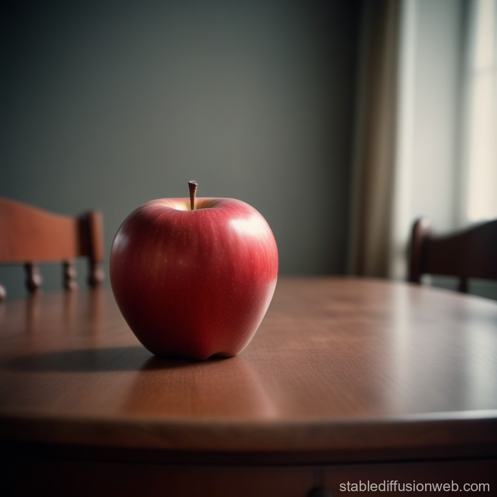

```{r setup, include=FALSE}
knitr::opts_chunk$set(echo = FALSE)
```


<!-- Hello everyone. Welcome to the new English class. We are delighted to have you here. Let's enjoy studying English together for the next year. -->

## Today's Key Phrase

<div style="display:inline-block;
  width:55%;vertical-align:top;">



 
</div><div style="display: inline-block;
  width:90%;vertical-align:top;">
<span style="font-size:144%;">There is an apple on the table.</span>

<!-- Look at the picture. What is on the table? There is an apple on the table. I will repeat again. There is an apple on the table. Please listen carefully. There is an apple on the table. -->

## Slide with Bullets

- Bullet 1
- Bullet 2
- Bullet 3

## Slide with R Output

```{r cars, echo = TRUE}
summary(cars)
```

## Slide with Plot

```{r pressure}
plot(pressure)
```

